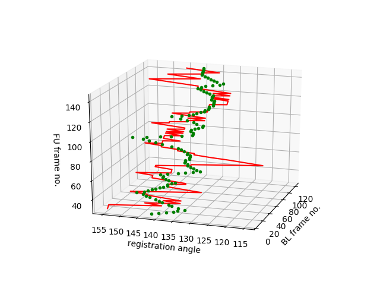
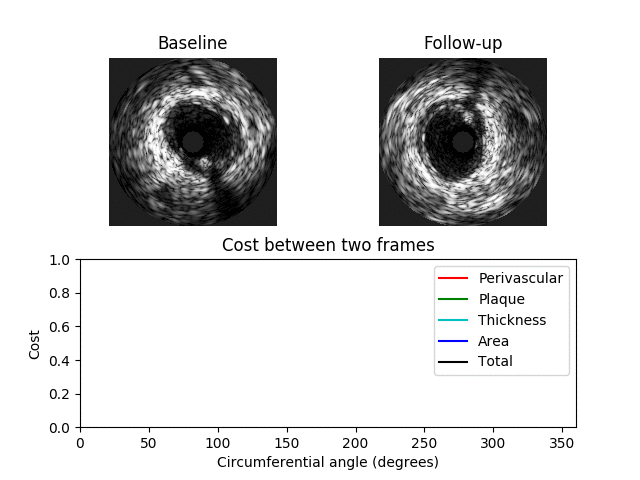
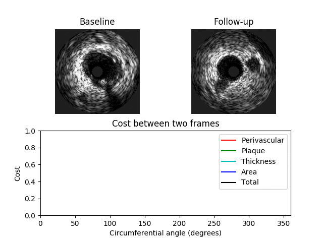

# IVUS Registration

This is a repository containing files to register one IVUS pullback with a second IVUS pullback. Typically these pullbacks are taken at 2 different timepoints such as baseline (BL) and follow-up (FU).
The code registers IVUS pullbacks in both the longitudinal and circumferential directions. In order to do this the code employs a 3D graph where an optimal path is found representing the optimum (with respect to the cost function) matching of images along the axis and along the circumferential direction.
The methodology employed here is based on two papers and any use of this work should consider citing the following papers.
1. Framework to co-register longitudinal virtual histology-intravascular ultrasound data in the circumferential direction. Timmins LH, Suever JD, Eshtehardi PE, McDaniel MC, Oshinski JN, Samady H, Giddens DP. 2013. IEEE Trans Med Img, Vol 32(11)
2. Simultaneous Registration of Location and Orientation in Intravascular Ultrasound Pullback Pairs Via 3D Graph-Based Optimization. Zhang L, Wahle A, Chen Z, Zhang L, Downe RW, Kovarnik T, Sonka M. 2015. IEEE Trans Med Img, Vol 34(12)


## Algorithm
A 3D graph is constructed where a value in the graph represents the similarity between two IVUS frames at a specific orientation where a value of 0 indicates a perfect match. 
The 3D graph has 3 axes: x-axis -> BL image; y-axis -> angle; z-axis -> FU image. The value **C**[i, j, k] contains the cost between the ith BL image and the kth FU image when the FU image is rotated by j degrees
The 3D graph/matrix **C** is generated from costs between image features at different orientations. The costs are computed for each feature separately and are weighted by user-specified values.
A cumulative cost matrix **CC** is then determined through dynamic programming. The minimal cost path through the cumulative cost matrix corresponds to the optimum registration between the BL and FU IVUS pullbacks. 


Minimum cost path through cumulative cost matrix

### Features
Four features are used to register the pullbacks. These are:

1. The perivascular tissue
2. The plaque tissue
3. The plaque thickness
4. The lumen area 

### Example costs
Examples showing when the cost is low (top) and high (bottom) between two different images are shown below. Here a minimum total cost of 0.4 is found when the FU image is rotated by 130 degrees. 
In the second example the minimum cost is 0.92 indicating a poor match between the images.




## Usage
Users should open registration.py and enter the patient/case name
```python
patient_name = 'my_patient'
```
Following this the user should enter the path to the IVUS images and contours
```python
# BL files
BLpath = 'path/to/BL/tif'
BLxmlpath = 'path/to/BL/xml'

# FU files
FUpath = 'path/to/FU/tif'
FUxmlpath = 'path/to/FU/xml'
```
Finally the user can enter the start and end frames automatic start and end frame detection is present however, the robustness of this is still under investigation.
```python
# start and end frames in format [BL, FU]
start_idx = [5, 28]
end_idx = [122, 145]
```


## Requirements
The following python libraries are required
Numpy  
PIL  
imutils  
matplotlib  
